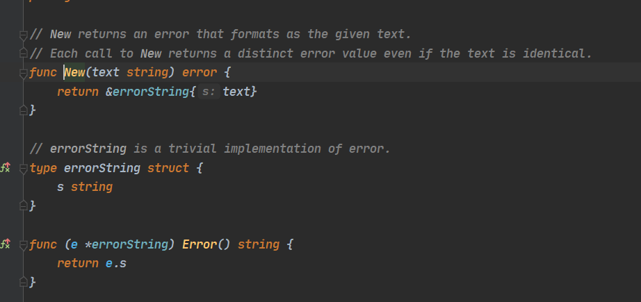

## Go 中的 Error 处理

### error  的部分内容讲解

#### Go ` error` 就是普通的一个接口，普通的值。

```go
// 实现了 Error func 的都可以算是 error 接口，比如
type MyError struct {}

func (e MyError) Error() string {
	return fmt.Sprintf("11") 
    //Sprintf formats according to a format specifier and returns the resulting string
}


// 另外 fmt 包中调用输出时，如果有满足了 error 接口的类型，那么输出会调用 Error func 输出
func main() {
	e := &MyError{}
	fmt.Println(e)  //11
}

```


* 我们经常使用 *errors.New()* 来返回一个 *error* 对象。

```go
err :=  errors.New("aa")
```

让我们来康康 New 里面有啥



 不难看出， `New`  也是返回  `error` 接口, 通过 `errorString` 结构体 实现 `Error` func 满足 `error` 接口从而输出

通过这个 `New` , 我们在找找,发现 源码包中<a name="bufio"> bufio/bufio.go </a>中同样有着这玩意


另外，值得注意的是，它返回的是调用的指针

```go
var ERROR = errors.New("aa")

func main() {
	err := errors.New("aa")
	err1 := errors.New("aa")
	fmt.Println(err == err1) //false
    
    //这才是正确使用方法
    err := ERROR
	fmt.Println(err == ERROR)  //true
}
```


接下来讲讲各种处理 `error` 的方式

### Sentinel Error

预定义的特定错误，我们叫为 sentinel error，这个名字来源于计算机编程中使用一个特定值来表示不可能进行进一步处理的做法。所以对于 Go，我们使用特定的值来表示错误, 比如上文例子中的 `var ERROR = errors.New("aa")` 以及 `bufio.go` 中 `New` 出来的 预定义错误 ，以及 io.EOF，更底层的syscall.ENOENT 等等

#### *sentinel error 处理错误*

*使用 sentinel 值是最不灵活的错误处理策略，因为调用方必须使用* *==* *将结果与预先声明的值进行比较。当您想要提供更多的上下文时，这就出现了一个问题，因为返回一个不同的错误将破坏相等性检查。*

*甚至是一些有意义的*  *fmt.Errorf*  携带一些上下文，也会破坏调用者的 *==* *，调用者将被迫查看 error**.Error()* *方法的输出，以查看它是否与特定的字符串匹配。*

#### *不依赖检查 error.Error 的输出*

Error  func 存在于 *error* 接口主要用于方便程序员使用，但不是程序（编写测试可能会依赖这个返回）。这个输出的字符串用于记录日志、输出到 *stdout* *等。*

虽然不够灵活，但使用预定义的错误后，这种特定的错误就不依赖 error.Error 的输出也可以得到有效的信息来做等值判断


### Error types

与错误值相比，错误类型的一大改进是它们能够包装底层错误以提供更多上下文。

#### os包中的示例

一个不错的例子就是`os` package 中 *os.PathError*  ，封装结构体表明它提供了底层执行了什么操作、那个路径出了什么问题。


#### 简易的 Error type 实例

Error type 是实现了 *error* 接口的自定义类型。例如 *MyError* 类型记录了文件和行号以展示发生了什么。

```go
type MyError struct {
	Msg  string
	File string
	Line int
}

func (e MyError) Error() string {
	return fmt.Sprintf("11 %s%d%s", e.File, e.Line, e.Msg)
}

//因为 MyError 是一个 type，调用者可以使用断言转换成这个类型，来获取更多的上下文信息。 
func main() {
	var err error
	err = &MyError{
		Msg:  "",
		File: "",
		Line: 0,
	}

	switch err1 := err.(type) {
	case nil:
		//没有错误，nothing to do
	case *MyError:
        //表明哪个具体地方错了
		fmt.Println("err 出现了: ", err1.Msg,err1.File,err1.Line)
	default:
		//unknown err
	}
}

```

调用者要使用类型断言和类型 *switch*，就要让自定义的 *error* 变为 public。这种模型会导致和调用者产生强耦合，从而导致 API 变得脆弱。

```
所谓 public 就比如大小写，大写就 "public" 了，处理错误必然要调包，比如 在 error package 中 New 的错误，在别的包处理它时就要调用 `error.xxxx`,成为公共 API ，同时也有可能会循环引用两个包而受到困扰
```

结论是尽量避免使用 error types，虽然错误类型比 sentinel errors 更好，因为它们可以自定义字段来捕获关于出错的更多上下文，但是 ` error types` 与  `sentinel errors`  有许多相同的问题。

*因此，我的建议是尽量避免错误类型，或者至少避免将它们作为 公共 API 的一部分。*


### Opaque errors

* Assert errors for behaviour, not type

#### net 包中的示例

在少数情况下，这种二分错误处理方法是不够的。例如，与进程外的世界进行交互（如网络活动），需要调用方调查错误的性质，以确定重试该操作是否合理。在这种情况下，我们可以断言错误实现了特定的行为，而不是断言错误是特定的类型或值。考虑` net `包中的这个例子：


* error , error本身是接口，实现开头提到的 Error func 就实现了 error 接口
* TImeout() , 实现这个func 就是实现 timeout 接口了

* Temporary() ,实现这个func 就是实现 temporary 接口了

正好在 net 包中找到了这样的例子，`UnknownNetworkError ` 这样的 type 实现了 Error 接口，因为是未知错误，表示它的 timeout() 和 temporary()   返回都是 false 表示 不是这两种类型的错误，而 func   Error 就把未知错误打印出来供 debug


这里的关键是，这个逻辑可以在不导入定义错误的包或者实际上不了解 err 的底层类型的情况下实现——我们只对它的行为结果感兴趣 (这个东西是不是发生了哪些错误)  

#### 简易实现 Opaque (不透明的)  error

我们可以模仿下这个思路

```go

type MyError struct {}
func (e MyError) Timeout() bool {
	//行为的处理过程...
	return true //处理完返回判断结果
}


type timeout interface {
	Timeout() bool
}

func IsTimeout(err error) bool {
	te, ok := err.(timeout)
    
	//处理过程 ...
	fmt.Println("是否实现了接口: ", ok) //没有实现说明不是这个错误或没错
	if te == nil {
		fmt.Println("没有实现接口，断言后的结果为 nil !")
	} else {
		fmt.Println("输出行为处理结果为: ", te.Timeout())
	}

	//返回判断错误结果，不关心错误的底层
	return ok && te.Timeout()
}

func main() {
	var err error
	err = &MyError{}

	result1 := IsTimeout(err)
	fmt.Println(result1)
	//是否实现了接口:  true
	//输出行为处理结果为:  true
	//true

	var err1 = errors.New("没有实现")
	result2 := IsTimeout(err1)
	fmt.Println(result2)
	//是否实现了接口:  false            
	//没有实现接口，断言后的结果为 nil !
	//false 
}


```


### Handling error

#### Indented flow is for errors 

无错误的正常流程代码，将成为一条直线，而不是缩进的代码，所以推荐前者


#### Eliminate error handling by eliminating errors

通过 减少处理错误的代码 来减轻 错误处理 (阅读代码层面)


这样可以更简介明了                 <a name="auth_code"> (为本文后续做个铺垫)</a>


###### 统计 *io.Reader* 读取内容的行数

```go
func CountLines(r io.Reader) (int, error) {
	var (
		br    = bufio.NewReader(r)
		lines int
		err   error
	)

	for {
		_, err = br.ReadString('\n')
		lines++
		if err != nil { // io.EOF
			break
		}
	}

	return lines, nil
}
```

简化版, (emmm,可能算不上简化，属于是另一种思路了，把错误暂存，后面抛给调用者

```go

func CountLines(r io.Reader) (int, error) {
	sc := bufio.NewScanner(r) //扫描 r 中内容
	lines := 0
	
	//sc.Scan()
	//It returns false when the scan stops, either by reaching the end of the input or an error.
	for sc.Scan() { 
		lines++
	}
	
	return lines,sc.Err()
}
```

##### 从 http 包中思考到的示例

来自源码的 `net/http/header.go` ，修改了部分

```go
type Header map[string][]string

func StatusText(code int) string {
	return statusText[code]
}

var statusText = map[int]string{
	1: "Continue",
	2: "Switching Protocols",
	3: "Processing",
	4: "Early Hints",
}

func WriteResponse(w io.Writer, body io.Reader, headers Header,
	code int, StatusText func(int) string) error {

	//协议头
	_, err := fmt.Fprintf(w, "HTTP/1.1 %d %s\r\n", code, StatusText(code))
	if err != nil {
		return err
	}

	//自定义的 Headers 加进去
	for header, values := range headers {
		for _, s := range values {
			_, err := fmt.Fprintf(w, "%s: %s\r\n", header, s)
			if err != nil {
				return err
			}
		}
	}

	// Headers 段过了还有个换行
	_, err = fmt.Fprintf(w, "\r\n")
	if err != nil {
		return err
	}

	//拷贝 body 进去
	_, err = io.Copy(w, body)
	return err
}

```

这里有许多的 if err != nil ,重复代码很多，下面看看优化后的版本

```go
//根据fmt.Fprintf 特性重写 io.Writer 接口，把错误处理写进去，减少重复代码
type errorWriter struct {
	io.Writer
	err error //类似 错误 的暂存器
}

func (e *errorWriter) Write(buf []byte) (int, error) {
	if e.err != nil {
		return 0, e.err
	}
	var n int
	n, e.err = e.Write(buf)
	return n, e.err
}

func WriteResponse(w io.Writer, body io.Reader, headers Header,
	code int, StatusText func(int) string) error {

	ew := &errorWriter{Writer: w}
	//协议
	fmt.Fprintf(ew, "HTTP/1.1 %d %s\r\n", code, StatusText(code))

	//自定义的 Headers 加进去
	for header, values := range headers {
		for _, s := range values {
			_, err := fmt.Fprintf(w, "%s: %s\r\n", header, s)
			if err != nil {
				return err
			}
		}
	}

	// Headers 段过了还有个换行
	fmt.Fprintf(ew, "\r\n")

	//拷贝 body 进去
	io.Copy(w, body)

	return ew.err
}
```


接下来就是很烦的 `Wrap errors`


#### Wrap errors

* wrap ,包裹
* Wrap errors 可以理解为 包裹错误，包多了就寄了

还记得之前我们  [auth](#auth_code)  的代码吧，如果 *authenticate* 返回错误，则 *AuthenticateRequest* 会将错误返回给调用方，调用者可能也会这样做，依此类推。

在程序的顶部，程序的主体将把错误打印到屏幕或日志文件中，打印出来的只是：没有这样的文件或目录(no such file or directory) 。

如果你未写过这样的代码，那么示例如下

##### err 套娃

下面代码是调用A() , 但是由于层层套娃，A()返回 not such file or directory

```go	
func A() {
	err := B()
	if err != nil {
		fmt.Println(err)
	}
}

func B() error {
	return C()
}

func C() error {
	return errors.New("not such file or directory")
}

func main() {
	A() //not such file or directory
}

```

改进

```go
func A() {
    // ........
	err := B()
	if err != nil {
		return
	}
    // .......
}

// B 业务
func B() error {
    //........
	return C()
}

// C 业务
func C() error {
    //.........
	log.Println("C业务 错误", errors.New("not such file or directory")) //相当于打印日志，供 debug
	return errors.New("not such file or directory")
}

func main() {
	A()
	//2022/04/02 16:18:24 C业务 错误 not such file or directory
}


```

开头加入错误的位置，能够更好 debug ,源码中同样有参考，如上文  [bufio](#bufio) 

同时加入上文的错误处理方法 或者 自定义新的 error 接口 也能 提高 debug 效率


**不过改进后，还是很难处理某些情况，比如**

You should only handle errors once. Handling an error means inspecting the error value, and making a single decision.

应该仅仅处理一次 error，而不是套娃

 我们经常发现类似的代码，在错误处理中，带了两个任务: 记录日志并且再次返回错误。

在这个例子中，如果在 *w.Write* 过程中发生了一个错误，那么一行代码将被写入日志文件中，记录错误发生的文件和行，并且错误也会返回给调用者，调用者可能会记录并返回它，一直返回到程序的顶部

```go

func WriteAll(w io.Writer, buf []byte) error {
	_, err := w.Write(buf)
	if err != nil {
        log.Println("xxx: unable to write:", err)  //如果出现 err，打印
	}
	return err
}

func WriteConfig(w io.Writer, conf []byte) error {
	err := WriteAll(w, conf)
	if err != nil {
        log.Println("xxx:  could not write config:", err)  //WriteAll 出现 err，打印
	}
	return err
}

```


日志记录与错误无关且对调试没有帮助的信息应被视为噪音，应予以质疑。记录的原因是因为某些东西失败了，而日志包含了答案。

•*The error has been logged.*

•*The application is back to 100% integrity.*

•*The current error is not reported any longer.*

•*错误要被日志记录。*

•*应用程序处理错误，保证**100%**完整性。*

•*之后不再报告当前错误。*


**go 官方也为也为这样的问题头疼，最终推出 go 1.13**

### Go 1.13

* *github.com/pkg/errors* 是一个第三方库，go官方在 go 1.13 采用了这个库的部分错误处理思想，可以自行查阅相关 wrap  error 的思想


#### **Errors before Go 1.13**


```go
//1.最简单的错误检查
	if err != nil {
	//something went wrong
	}

//2.有时我们需要对 sentinel error 进行检查
var ERROR = errors.New("not found")
if err == ERROR {
   //something not found  
}  

//3.实现了 error interface 的自定义 error struct，进行断言使用获取更丰富的上下文, 即上文的 error types
	switch err1 := err.(type) {
	case nil:
		//没有错误，nothing to do
	case *MyError:
        //表明哪个具体地方错了
		fmt.Println("err 出现了: ", err1.Msg,err1.File,err1.Line)
	default:
		//unknown err
	}

//4.函数在调用栈中添加信息向上传递错误，例如对错误发生时发生的情况的简要描述。
	if err != nil {
		return fmt.Errorf("xxxxxxxxxxx %v%: v",name,err)
	}

//5.使用创建新错误 fmt.Errorf 丢弃原始错误中除文本外的所有内容。正如我们在 QueryError 中看到的那样，我们有时可能需要定义一个包含底层错误的新错误类型，并将其保存以供代码检查。这里是 QueryError：
type QueryError struct {
	err error
	Query string
}

//6.程序可以查看 QueryError 值以根据底层错误做出决策。
	if e,ok := err.(*QueryError); ok && e.Err == ErrPermission {
		//query failed because of a problem about permission
	}

```


#### **Errors after Go 1.13**


**go1.13为** **errors** **和** **fmt** **标准库包引入了新特性，以简化处理包含其他错误的错误。**

* **其中最重要的是: ** **包含另一个错误的** **error** **可以实现返回底层错误的** **Unwrap** **方法。如果** **e1.Unwrap()** **返回** **e2**，那么我们说 **e1** **包装** **e2**，您可以展开 **e1** **以获得** **e2**

* **fmt.Errorf** 引入 %w , 	b 为对 a 错误拓展的结果，不会影响 b 的根因 ==  a的根因 ，详见下面的 **` Is `**例子

* 来自  errors/wrap.go

```go
// Unwrap returns the result of calling the Unwrap method on err, if err's
// type contains an Unwrap method returning error.
// Otherwise, Unwrap returns nil.
/*
func Unwrap(err error) error {
	u, ok := err.(interface {
		Unwrap() error
	})
	if !ok {
		return nil
	}
	return u.Unwrap()
}
*/

package main
 
import "fmt"
import "errors"
 
type ErrorString struct {
    s string
}
 
func (e *ErrorString) Error() string {
    return e.s
}
 
func main() {
	e := errors.New("原始错误e")
	
	w := fmt.Errorf("Wrap了一个错误%w", e)//加了一个%w来生成一个可以Wrapping Error,err赋值给e,
	
	fmt.Println(errors.Unwrap(w))//返回e
	
	fmt.Println(errors.Is(w,e))//Is用以判断嵌套情况下的两个error是否包含，func Is(err, target error) bool，如果err和target是同一个或err 是一个wrap error,target也包含在这个嵌套error链中的话，那么也返回true
	
	//在Go 1.13之前没有wrapping error的时候，我们要把error转为另外一个error，一般都是使用type assertion 或者 type switch，其实也就是类型断言
	//但是对于前提的方式，上述方式就不能用了，所以Golang为我们在errors包里提供了As函数。用于error的类型断言
	var targetErr *ErrorString
    err := fmt.Errorf("new error:[%w]", &ErrorString{s:"target err"})
    fmt.Println(errors.As(err, &targetErr))  //true
}
```


**按照此约定，我们可以为上面的** **QueryError** **类型指定一个** **Unwrap** **方法，该方法返回其包含的错误**

```go
func (e *QueryError) Unwrap() error {
	return e.Err
}
```


**go1.13** **errors** **包包含两个用于检查错误的新函数：`Is ` 和 `As` **

**`Is`** 

```go	
//类似于 if err == ErrNotFound  {}
//if errors.Is(err,ErrNotFound)
//但是又有了拓展
//go 1.13 之前通过 fmt.Errorf() 输出错误给上层， err 会改变他的值， == 就会失效， Is 就能和上层的错误正常判断相等，原理是判断根因
//通过下面这个例子理解

var a = errors.New("a")

func main() {
	b := fmt.Errorf("aaaa %w", a)

	fmt.Println(b)//aaaa a ,说明b的值变了

	fmt.Println(b == a) //false，值变化了所以false

	fmt.Println(errors.Is(b, a)) //true，判断的是根因，所以相等
}
```

 

**`As`** 

```go

type QueryError struct{}

func (e QueryError) Error() string {
	return "a"
}

func main() {
	var a error
	a = &QueryError{}

	b := fmt.Errorf("aaaa %w", a)  //拓展了，根因不变，预期结果与 Is 同理

	_, ok := b.(*QueryError)
	fmt.Println(ok) //false

	_, ok = a.(*QueryError)
	fmt.Println(ok) //true

    //关于下面的 &
    //Second argument to 'errors.As' must be a pointer to an interface or to a type implementing the error interface 
    //“错误”的第二个参数。'As'必须是指向接口或实现错误接口的类型的指针
    //加 & 变成实现 error 接口的指针
	fmt.Println(errors.As(b, &a)) //true
}

```


* 建议统一使用 **`errors.Is()`** 和 **` errors.As()`** 做判断处理


#### **Customizing error tests with Is and As methods**

从源码可以看出，`Is `会先判断有没有实现 `Is` 方法，没有实现就按它本身的方法处理，因此我们可以自定义 `Is` 来做定制化的判断

```go
// An error type might provide an Is method so it can be treated as equivalent
// to an existing error. For example, if MyError defines
//
//func (m MyError) Is(target error) bool { return target == fs.ErrExist }
// then Is(MyError{}, fs.ErrExist) returns true. See syscall.Errno.Is for
// an example in the standard library.
```


```go
type Error struct {
	Path string
	User string
}

func (e Error) Error() string {
	return "error"
}

func (e Error) Is(target error) bool {
	fmt.Println("------------------------------------")
	return true
}
func main() {
	a := &Error{
		Path: "ss",
		User: "",
	}

	b := &Error{
		Path: "ss",
		User: "",
	}

	fmt.Println(errors.Is(b, a)) //true,注释掉 Is 后为 false
}
```

`As ` 同理


```go

type QueryError struct{}

func (e QueryError) Error() string {
	return "a"
}

func (e QueryError) As(interface{}) bool {
	fmt.Println("------------------------------------")
	return true
}

func main() {
	var b error

	b = &QueryError{}

	fmt.Println(errors.As(b, &QueryError{})) //true,注释掉 Is 后为 false
}

```


#### Reference

```
https://www.infoq.cn/news/2012/11/go-error-handle/
https://golang.org/doc/faq#exceptions
https://www.ardanlabs.com/blog/2014/10/error-handling-in-go-part-i.html
https://www.ardanlabs.com/blog/2014/11/error-handling-in-go-part-ii.html
https://www.ardanlabs.com/blog/2017/05/design-philosophy-on-logging.html
https://medium.com/gett-engineering/error-handling-in-go-53b8a7112d04
https://medium.com/gett-engineering/error-handling-in-go-1-13-5ee6d1e0a55c
https://rauljordan.com/2020/07/06/why-go-error-handling-is-awesome.html
https://morsmachine.dk/error-handling
https://crawshaw.io/blog/xerrors
```

