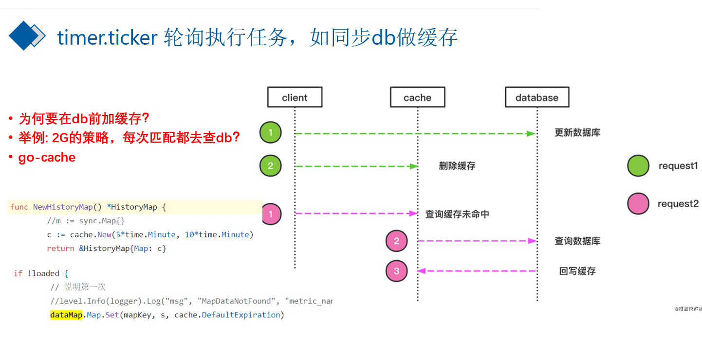
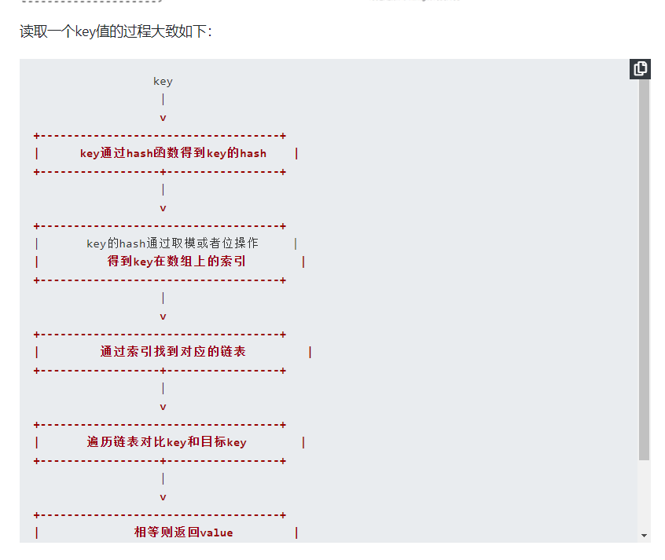
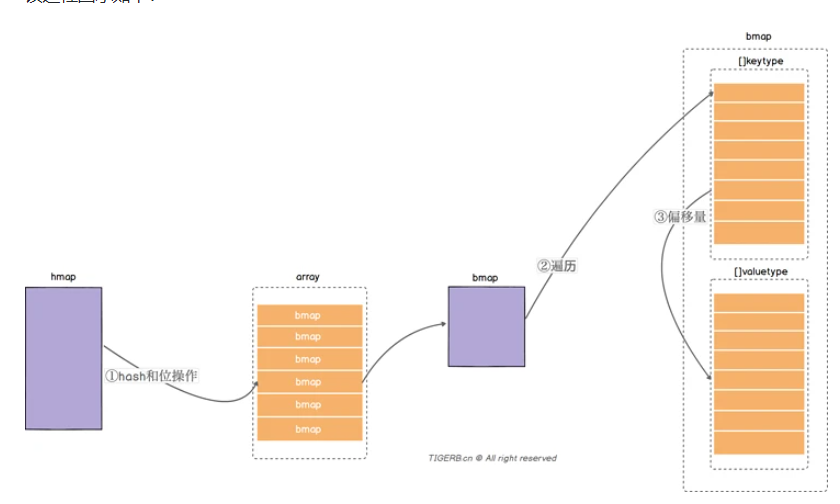
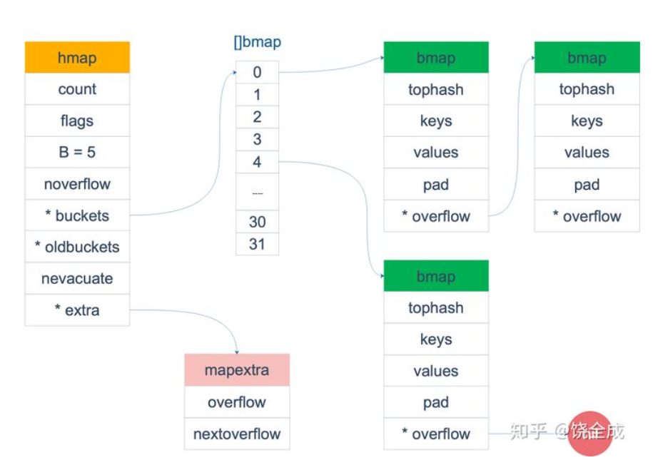

# map使用


## 声明和初始化 
### 使用var只声明
-  只声明

```go	
var gMap map[string]string
```


### 使用var声明同时初始化
- 声明初始化

```go
 var hMap = map[string]string{"a": "b"}
```


### 使用make 初始化

```go
var m = make(map[string]string,10)
```


## 增删改查
### 读取数据
- 两种手段 第一种 单变量 lang:=m["lang"]，没有key就附一个value类型的0值
- 两种手段 第二种 双变量 app2,exists := m["app2"]，可以根据exists判断 true代表有key


### 增删改查举例
- 举例
```go
package main

import "fmt"

// 只声明
var m1 map[string]string

// 声明又初始化
var m2 = map[string]string{"a": "b"}

func main() {
   m := make(map[string]string)
   // 增加
   m["app"] = "taobao"
   m["lang"] = "golang"
   // 删除
   delete(m, "app")
   fmt.Println(m)
   // 改
   m["lang"] = "python"
   // 查
   // 单变量形式
   lang := m["lang"]
   fmt.Println(lang)
   // 双变量形式
   lang1, exists := m["lang"]
   if exists {
      fmt.Printf("[lang存在 值：%v]\n", lang1)
   } else {
      fmt.Println("lang不存在\n")
      m["lang"] = "java"
   }

}
```

### 遍历map和按key的顺序遍历
- 举例
```go
package main

import "fmt"

// 只声明
var m1 map[string]string

// 声明又初始化
var m2 = map[string]string{"a": "b"}

func main() {
	m := make(map[string]int)
	keys := make([]string, 0)
	for i := 0; i < 20; i++ {
		key := fmt.Sprintf("key_%d", i)
		keys = append(keys, key)
		m[key] = i
	}
	fmt.Println(m)
	// range 遍历 keys
	//for k := range m {
	//	fmt.Printf("[key=%s]\n", k)
	//}

	fmt.Println("无序遍历")
	// range 遍历
	for k, v := range m {
		fmt.Printf("[%s=%d]\n", k, v)
	}
	// 有序key遍历
	fmt.Println("有序遍历")
	for _, k := range keys {
		fmt.Printf("[%s=%d]\n", k, m[k])
	}
}

```

## key的类型：float64可以作为key吗
- bool、int、string
- 特征是 支持 `== `  和  `!=`  比较
- float型可以做为key的，写入map时会做math.Float64bits()的转换，认为2.4=2.40000xxxx1 ，看起来是同一个key
```go
package main

import "fmt"

func main() {
	m := make(map[float64]int)
	m[2.4] = 2
	fmt.Printf("k: %v, v: %d\n", 2.4000000000000000000000001, m[2.4000000000000000000000001])
	fmt.Println(m[2.4000000000000000000000001] == m[2.4])
}

```
## value的类型：任意类型
- map的value是个map,每一层map都要make

```go
package main

func main() {
	var doubleM map[string]map[string]string
	// panic: assignment to entry in nil map
	//doubleM = make(map[string]map[string]string)
	v1 := make(map[string]string)
	v1["k1"] = "v1"
	doubleM["m1"] = v1

}

```


## go原生的map线程不安全

### fatal error :concurrent map read and map write
- 举例
```go
package main

import "time"

func main() {
	c := make(map[int]int)
	// 匿名goroutine 循环写map
	go func() {
		for i := 0; i < 10000; i++ {
			c[i] = i
		}
	}()

	// 匿名goroutine 循环读map
	go func() {
		for i := 0; i < 10000; i++ {
			_ = c[i]
		}
	}()

	time.Sleep(30 * time.Minute)
}

```

### fatal error: concurrent map writes
- 举例
```go
package main

import "time"

func main() {

	c := make(map[int]int)
	// 匿名goroutine 循环写map
	go func() {
		for i := 0; i < 10000; i++ {
			c[i] = i
		}
	}()

	// 匿名goroutine 循环写map
	go func() {
		for i := 0; i < 10000; i++ {
			c[i] = i
		}
	}()

	time.Sleep(30 * time.Minute)
}

```

### 上述问题原因
- go原生的map线程不安全 具体原因情况 [go中的读写锁](./2022-04-03-go中的锁.md)
- **下面的解决方法仅仅是让线程可以读取值，而不报错，不能保证读取前一定被写入内容**

### 解决方法之一 加锁
- 使用读写锁
```go
package main

import (
	"fmt"
	"sync"
	"time"
)

// 为了解决map线程不安全 ，我们自己加锁

type concurrentMap struct {
	mp map[int]int
	sync.RWMutex
}

// 通过set 方法做原有map的赋值 m[key] =v
func (c *concurrentMap) Set(key, value int) {
	// 加写锁
	c.Lock()
	c.mp[key] = value
	c.Unlock()

}

// 通过get 方法做原有map的读取值操作 v:= m[key]
func (c *concurrentMap) Get(key int) int {
	//先获取读锁
	c.RLock()
	res := c.mp[key]
	c.RUnlock()
	return res
}

func main() {
	c := concurrentMap{
		mp: make(map[int]int),
	}
	// 一个线程循环写map
	go func() {
		for i := 0; i < 10000; i++ {
			c.Set(i, i)
		}
	}()
	// 一个线程循环读map
	go func() {
		for i := 0; i < 10000; i++ {
			res := c.Get(i)
			fmt.Printf("[cmap.get][%d=%d]\n", i, res)
		}
	}()
	time.Sleep(1 * time.Hour)

}

```


### 解决方法之二 使用sync.map

- go 1.9引入的内置方法，并发线程安全的map
- sync.Map 将key和value 按照interface{}存储
- 查询出来后要类型断言 x.(int) x.(string)
- 遍历使用Range() 方法，需要传入一个匿名函数作为参数，匿名函数的参数为k,v interface{}，每次调用匿名函数将结果返回。

- 举例 sync.map 的应用

```go
package main

import (
	"fmt"
	"log"
	"strings"
	"sync"
)

func main() {

	m := sync.Map{}
	// 新增
	for i := 0; i < 10; i++ {
		key := fmt.Sprintf("key_%d", i)
		m.Store(key, i)
	}
	// 删除
	m.Delete("key_8")

	// 改m.Store
	m.Store("key_9", 999)

	// 查询
	res, loaded := m.Load("key_9")
	if loaded {
		//  类型断言 res.(int)
		log.Printf("[key_9存在 :%v 数字类型:%d]", res, res.(int))
	}

	// 遍历 return false 停止
	m.Range(func(key, value interface{}) bool {
		k := key.(string)
		v := value.(int)
		if strings.HasSuffix(k, "3") {
			log.Printf("不想要3")
			//return true
			return false
		} else {
			log.Printf("[sync.map.Range][遍历][key:=%s][v:=%d]", k, v)
			return true
		}
	})
	// LoadAndDelete 先获取值再删掉
	s1, loaded := m.LoadAndDelete("key_7")
	log.Printf("key_7 LoadAndDelete :%v", s1)
	s2, loaded := m.Load("key_7")
	log.Printf("key_7 LoadAndDelete:%v", s2)

	actual, loaded := m.LoadOrStore("key_8", 158)
	if loaded {
		log.Printf("key_8原来的值是:%v", actual)
	} else {
		log.Printf("key_8原来没有，实际是:%v", actual)
	}

	actual, loaded = m.LoadOrStore("key_1", 158)
	if loaded {
		log.Printf("key_1原来的值是:%v", actual)
	} else {
		log.Printf("key_1原来没有，现在是:%v", actual)
	}
}

```

#### 测试是否会报错(线程安全)

```go
package main

import (
	"fmt"
	"sync"
	"time"
)

func main() {

	m := sync.Map{}
	go func() {
		// 写入
		for i := 0; i < 10; i++ {
			fmt.Println("store: ", i)
			m.Store(i, i)
		}
	}()

	go func() {
		// 读取
		for i := 0; i < 10; i++ {
			value, ok := m.Load(i)
			fmt.Println("load:", ok, value)
		}
	}()

	time.Sleep(time.Hour)
}

```


### sync.map 性能对比
- https://studygolang.com/articles/27515

- 性能对比结论
```shell script
只读场景：sync.map > rwmutex >> mutex
读写场景（边读边写）：rwmutex > mutex >> sync.map
读写场景（读80% 写20%）：sync.map > rwmutex > mutex
读写场景（读98% 写2%）：sync.map > rwmutex >> mutex
只写场景：sync.map >> mutex > rwmutex
```
- sync.Map使用场景的建议
    - 读多：给定的key-v只写一次，但是读了很多次，只增长的缓存场景
    - key不相交： 覆盖更新的场景比少
    
- 结构体复杂的case多不用sync.Map

> 上述两种手段有什么问题
- 没有精细化锁控制 没有分片
- 加了大锁

###  分片锁 并发map         **github.com/orcaman/concurrent-map**

- 基础用法 
```go
package main

import (
	"fmt"
	"github.com/orcaman/concurrent-map"
	"log"
	"time"
)

func main() {
	// Create a new map.
	m := cmap.New()

	// 循环写map
	go func() {

		for i := 0; i < 10000; i++ {
			key := fmt.Sprintf("key_%d", i)
			m.Set(key, i)
		}

	}()
	// 循环读map
	go func() {

		for i := 0; i < 10000; i++ {
			key := fmt.Sprintf("key_%d", i)
			v, exists := m.Get(key)
			if exists {
				log.Printf("[%s=%v]", key, v)
			}
		}

	}()
	// 循环写map
	go func() {

		for i := 0; i < 10000; i++ {
			key := fmt.Sprintf("key_%d", i)
			m.Set(key, i)
		}

	}()
	// 循环写map
	go func() {

		for i := 0; i < 10000; i++ {
			key := fmt.Sprintf("key_%d", i)
			m.Set(key, i)
		}

	}()
	// 循环写map
	go func() {

		for i := 0; i < 10000; i++ {
			key := fmt.Sprintf("key_%d", i)
			m.Set(key, i)
		}

	}()

	time.Sleep(1 * time.Hour)

}

```


### 带过期时间的map
- 为什么要有过期时间
- map做缓存用的 垃圾堆积k1  k2 
- 希望缓存存活时间 5分钟，
- 将加锁的时间控制在最低，
- 耗时的操作在加锁外侧做

```go
package main

import (
	"fmt"
	"log"
	"sync"
	"time"
)

//带过期时间的map 定时清理

type Cache struct {
	sync.RWMutex
	mp map[string]*item
}

type item struct {
	value int   //值
	ts    int64 // 时间戳，item 被创建出来的时间
}

func (c *Cache) Get(key string) *item {
	c.RLock()
	defer c.RUnlock()
	return c.mp[key]
}

func (c *Cache) CacheNum() int {
	c.RLock()

	keys := make([]string, 0)
	//i := 0
	for k, _ := range c.mp {
		//fmt.Println(k)
		keys = append(keys, k)
		//i++

	}
	c.RUnlock()
	return len(keys)
}

func (c *Cache) Set(key string, value *item) {
	c.Lock()
	defer c.Unlock()
	c.mp[key] = value
}

func (c *Cache) Clean(timeDelta int64) {
	// 每5秒执行一此清理
	for {
		now := time.Now().Unix()
		// 待删除的key的切片
		toDelKeys := make([]string, 0)

		// 先加读锁，把所有待删除的拿到
		c.RLock()
		for k, v := range c.mp {
			// 时间比较
			if now-v.ts > timeDelta {
				// 认为这个k,v过期了,
				// 不直接删除，为了降低加锁时间，加入待删除的切片
				toDelKeys = append(toDelKeys, k)
			}
		}
		c.RUnlock()

		// 加写锁 删除,降低加写锁的时间
		c.Lock()
		for _, k := range toDelKeys {
			log.Printf("[删除过期数据][key:%s]", k)
			delete(c.mp, k)
		}
		c.Unlock()
		//	写锁释放
		time.Sleep(2 * time.Second)
	}
}

func main() {
	c := Cache{
		mp: make(map[string]*item),
	}
	// 让清理的任务异步执行
	// 每2秒运行一次，检查时间差大于30秒item 就删除
	go c.Clean(30)
 
	// 从mysql中读取到了数据，塞入缓存
	for i := 0; i < 10; i++ {
		key := fmt.Sprintf("key_%d", i)
		ts := time.Now().Unix()
		im := &item{
			value: i,
			ts:    ts,
		}
		// 设置缓存
		log.Printf("[设置缓存][item][key:%s][v:%v]", key, im)
		c.Set(key, im)
	}
	log.Printf("缓存中的数据量:%d", c.CacheNum())
	time.Sleep(33 * time.Second)

	log.Printf("缓存中的数据量:%d", c.CacheNum())

	// 更新缓存
	for i := 0; i < 5; i++ {
		key := fmt.Sprintf("key_%d", i)
		ts := time.Now().Unix()
		im := &item{
			value: i,
			ts:    ts,
		}
		// 设置缓存
		log.Printf("[更新缓存][item][key:%s][v:%v]", key, im)
		c.Set(key, im)
	}
	log.Printf("缓存中的数据量:%d", c.CacheNum())
	select {}
}

```


### 带过期时间的缓存          github.com/patrickmn/go-cache 
> 简单应用上手
```go
package main

import (
	"fmt"
	"github.com/patrickmn/go-cache"
	"time"
)

func main() {
	// Create a cache with a default expiration time of 5 minutes, and which
	// purges expired items every 10 minutes
	c := cache.New(30*time.Second, 5*time.Second)

	// eSet the value of the key "foo" to "bar", with the default xpiration time
	c.Set("k1", "v1", 31*time.Second)
	res, ok := c.Get("k1")
	fmt.Println(res, ok)
	time.Sleep(time.Second * 32)
	res, ok = c.Get("k1")
	fmt.Println(res, ok)
}

```

> 生产上的 web缓存应用
- 查询触发性质的
```go
package main

import (
	"fmt"
	"github.com/patrickmn/go-cache"
	"log"
	"time"
)

// 生产上的 web缓存应用
// 维护用户信息的模块
// 在mysql中有一张 user表
// 正常情况是用orm gorm xorm 去db中查询
// 查询qps很高，为了性能会加缓存
//（更新不会太频繁） ，说明在一定时间内，获取到旧数据也能容忍

type user struct {
	Name  string
	Email string
	Phone int64
}

var (
	DefaultInterval = time.Minute * 1
	UserCache       = cache.New(DefaultInterval, DefaultInterval)
)

// 最外层调用函数
// 优先去本地缓存中查，有就返回
// 没有再去远端查询 ，远端用http表示
func GetUser(name string) user {
	// 消耗 0.1cpu 0.1M内存 0.1秒返回
	res, found := UserCache.Get(name)
	if found {
		//if res, found := UserCache.Get(name); found {
		log.Printf("[本地缓存中找到了对应的用户][name：%v][value:%v]", name, res.(user))
		return res.(user)
		// 消耗 1cpu 10M内存 3秒返回
	} else {
		res := HttpGetUser(name)
		log.Printf("[本地缓存中没找到对应的用户，去远端查询获取到了，塞入缓存中][name：%v][value:%v]", name, res)
		// 本地没有，但是从远端拿到了最新的数据
		// 更新本地缓存 ,我种树，其他人乘凉
		UserCache.Set(name, res, DefaultInterval)
		return res
	}
}
func HttpGetUser(name string) user {
	// mock 模拟我去接口查
	u := user{
		Name:  name,
		Email: "qq.com",
		Phone: time.Now().Unix(),
	}
	return u
}

// 查询方法

func queryUser() {
	for i := 0; i < 10; i++ {
		userName := fmt.Sprintf("user_name_%d", i)
		GetUser(userName)
	}
}

func main() {
	log.Printf("第1次query_user")
	queryUser()
	log.Printf("第2次query_user")
	queryUser()
	queryUser()
	queryUser()
	queryUser()
	queryUser()
	time.Sleep(61 * time.Second)
	log.Printf("第3次query_user")
	queryUser()
}

```


# map的实际应用 



# map的原理




## map底层原理文章推荐
- https://zhuanlan.zhihu.com/p/66676224
- https://segmentfault.com/a/1190000039101378
- https://draveness.me/golang/docs/part2-foundation/ch03-datastructure/golang-hashmap/

