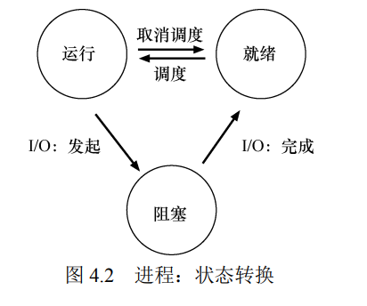

# 操作系统笔记


## 第四章 抽象：进程  

**本章主要讨论进程**

### 虚拟化

#### Q : 关键问题：如何提供有许多 CPU 的假象？

* 虽然只有少量的物理 CPU 可用，但是操作系统如何提供几乎有无数个 CPU 可用的假象？

#### A: 操作系统通过虚拟化（virtualizing）CPU 来提供这种假象。

```
主要实现方法：

时分共享
# 让一个进程值运行一个时间片，后续切换其他进程，提供虚拟的假象
在时分共享基础上，继而实现一些调度的策略

```


### 4.1 抽象：进程 

* 操作系统为正在运行的程序提供的抽象，就是所谓的进程（process）。

#### 进程的构成

```
为了理解构成进程的是什么，我们必须理解它的机器状态（machine state）：程序在运行
时可以读取或更新的内容。在任何时刻，机器的哪些部分对执行该程序很重要？
```

* **内存**，指令存在内存中，正在运行的 程序读取和写入的数据也在内存中，进程可以访问的内存（称为地址空间，address space） 是该进程的一部分
* **寄存器** ，许多指令明确地读取或更新寄存器，因此显然， 它们对于执行该进程很重要


### 4.2 进程 API 

```sh
# 创建（create）
操作系统必须包含一些创建新进程的方法。在 shell 中键入命令或双击应用程序图标时，会调用操作系统来创建新进程，运行指定的程序。

# 销毁（destroy）
由于存在创建进程的接口，因此系统还提供了一个强制销毁进程的接口。当然，很多进程会在运行完成后自行退出。但是，如果它们不退出，
用户可能希望终止它们，因此停止失控进程的接口非常有用

# 等待（wait）
有时等待进程停止运行是有用的，因此经常提供某种等待接口。

#其他控制（miscellaneous control）
除了杀死或等待进程外，有时还可能有其他控制。例如，大多数操作系统提供某种方法来暂停进程（停止运行一段时间），然后恢复（继续运行）。

# 状态（status）
通常也有一些接口可以获得有关进程的状态信息，例如运行了多长时间，或者处于什么状态。
```


### 4.3 进程创建

* 代码和静态数据加载到内存
* 为程序的运行时栈（run-time stack 或 stack）分配一些内存,也可能为程序的堆（heap）分配一些内存  eg:  ( 放局部变量、函数参数和返回地址 )
* 操作系统还将执行一些其他初始化任务，特别是与输入/输出（I/O）相关的任务
* 启动程序      ( 在入口处运行，即 main()


### 4.4 进程状态 

```apl
# 运行（running）
在运行状态下，进程正在处理器上运行。这意味着它正在执行指令。
# 就绪（ready）
在就绪状态下，进程已准备好运行，但由于某种原因，操作系统选择不在此时运行。
# 阻塞（blocked）
在阻塞状态下，一个进程执行了某种操作，直到发生其他事件时才会准备运行。
一个常见的例子是，当进程向磁盘发起 I/O 请求时，它会被阻塞，因此其他进程可以使用处理器
```





## 第 6 章 机制：受限直接执行

为了虚拟化 CPU，操作系统需要以某种方式让许多任务共享物理 CPU，让它们看起来 像是同时运行。

```
基本思想很简单：运行一个进程一段时间，然后运行另一个进程，如此轮
换。通过以这种方式时分共享（time sharing）CPU，就实现了虚拟化
```

然而，在构建这样的虚拟化机制时存在一些挑战。

* 性能 :   如何在不增加系统 开销的情况下实现虚拟化？
* 控制权 :  如何有效地运行进程，同时保留对 CPU 的控制？

### 关键问题：如何高效、可控地虚拟化 CPU

```
操作系统必须以高性能的方式虚拟化 CPU，同时保持对系统的控制。为此，需要硬件和操作系统支
持。操作系统通常会明智地利用硬件支持，以便高效地实现其工作。
```


### 6.1 基本技巧：受限直接执行

* 只需直接在 CPU 上运行程序即可

#### **问题** 

* 如何确保安全且高效
* 如何切换


### 6.2 问题 1：如何执行受限制的操作 ？

一个进程必须能够执行 I/O 和其他一些受限制的操作，但又不能让进程完全控制系统。操作系统和 硬件如何协作实现这一点？

是让所有进程做所有它想做的事情？

####  **解决**

引入一种新的处理器模式，称为用户模式（user mode）

* 与用户模式不同的内核模式（kernel mode），操作系统（或内核）就以这种模式运行。


#### 挑战——如果用户希望执行某种特权操作（如从磁盘读取）

* 执行系统调用

```
 要执行系统调用，程序必须执行特殊的陷阱（trap）指令
 简单来说 trap 进内核，执行 你要的 等搞完了， 回到 user mode
```


#### 细节

trap 如何知道在 OS 内运行哪些代码？

* 不能让你随便执行任意指令

**采用 trap table**

* 决定了你只能执行哪些操作


### 6.3 问题 2：在进程之间切换 


#### **关键问题：如何重获 CPU 的控制权**？


**OS 通过等待系统调用，或某种非法操作发生，从而重新获 得 CPU 的控制权**

* 等待系统调用

  * 大多数进程通过进行系统调用，将 CPU 的控制权转移给操作系统
  * 执行了某些非法操作，也会将控制转移给操作系统

  

  #### 进程拒绝进行系统调用?

* 操作系统进行控制

如果**进程拒绝进行系统调用**（也不出错），从而**拒绝把控制权交还给操作系统**，那么操作系统无法做任何事情

#####	关键问题：如何在没有协作的情况下获得控制权

* 利用时钟中断重新获得控制权


#### 保存和恢复上下文 

操作系统获得了控制权，无论是通过系统调用协作，还是通过时钟中断 强制执行，都必须决定：是继续运行当前正在运行的进程，还是切换到另一个进程


**决定切换的时候**

```apl
为当前正在执行的进程保存一些寄存器的值（例如，到它的内核栈），并为即将执行的进程恢复一些寄存器的值（从它的内核栈）。

执行一些底层汇编代码，来保存通用寄存器、程序计数器，
以及当前正在运行的进程的内核栈指针，
然后恢复寄存器、程序计数器，并切换内核栈，供即将运行的进程使用
```


##  第 7 章 进程调度：介绍

介绍一系列的调度策略（sheduling policy，有时称 为 discipline）

#### 关键问题：如何开发调度策略


### 7.1 工作负载假设 

* 就是想想工作进程有哪些结果
* 前置条件是我们已知每个 job 的运行时间

### 7.2 调度指标  

*  周转时间
  * T 周转时间= T 完成时间−T 到达时间 
  * 假设所有的任务在同一时间到达，那么 T 到达时间= 0
* 响应时间
  *  响应时间= T 首次运行−T 到达时间

**性能和公平在调度系 统中往往是矛盾的**


### 7.3 先进先出（FIFO） 

* 谁先来谁先run
* 它很简单，而且易于实现。

```apl
# 3 个 都是 10s 的 job
A 在 10s 时完成，B 在 20s 时完成，C 在 30s 时完成。
因此，这 3个任务的平均周转时间就是（10 + 20 + 30）/ 3 = 20

# A 100s 的话
A 先运行 100s，B 或 C 才有机会运行。
因此，系统的平均周转时间是比较高的：令人不快的 110s（（100 + 110 + 120）/ 3 = 110）
```


### 7.4 最短任务优先（SJF） 

```apl
# A 100s 的话
A 先运行 100s，B 或 C 才有机会运行。
因此，系统的平均周转时间是比较高的：令人不快的 110s（（100 + 110 + 120）/ 3 = 110）
SJF 将平均周转时间从 110s 降低到 50s（（10 + 20 + 120）/3 = 50）。
```

考虑到所有工作同时到达的假设，我们可以证明 SJF 确实是一个最优（optimal） 调度算法,但是

```apl
#在这里我们可以再次用一个例子来说明问题。
现在，假设 A 在 t = 0 时到达，且需要运行 100s。而 B 和 C 在 t = 10 到达，且各需要运行 10s。
#用纯 SJF
（100+（110−10）+（120−10））/3 = 103.33s
```


### 7.5 最短完成时间优先（STCF） 

* 每当新工作进入系统时，它就会确定剩余工作和新工作中， 谁的剩余时间最少，然后调度该工作

``` apl
# 咱就是说，先 run 着，有新的来，看哪个牛逼
现在，假设 A 在 t = 0 时到达，且需要运行 100s。而 B 和 C 在 t = 10 到达，且各需要运行 10s。
# 0 - 10s
A 先 run 着
# 10s
B,C 进来辣，显然B,C更快更牛逼，选择B 或 C
# 10 - 20s
run B/C      假设是 B
# 20s 
同样选牛逼的，肯定是上个10s剩下的B 或者 C
# 20 - 30s
run B/C       是C
# 30 - 120s
run A
#       B    C    A
总共 （ 10 + 20 + 120 ）/ 3 = 50
```


### 7.6 新度量指标：响应时间

**上个例子中的 作业 A 为 0，B 为 0，C 为 10（平均：3.33）。**


### 7.7 轮转  ( RR

基本思想很简单：

* RR 在一个时间片（time slice，有时称为调度量子，scheduling quantum）内运行一个工作，然后切换到运行队列中的下一个任务，而不是运行一个任务直 到结束
* 时间片长度必须是时钟中断周期的倍数


#### 用处

拿来提高响应时间

#### 越短，RR 在响应时间上表现越好

#### 但是 ，时间片太短是有问题的：突然上下文切换的成本将影响整体性能

```apl
因此，系统设计者需要权衡时间片的长度，
使其足够长，以便摊销（amortize）上下文切换成本，
而又不会使系统不及时响应。
```


#### 问题

```
如果周转时间是我们的指标，那么 RR 确实是最糟糕的策略之一。
RR 所做的正是延伸每个工作，只运行每个工作一小段时间，就转向下一个工作。
因为周转时间只关心作业何时完成，RR 几乎是最差的，在很多情况下甚至比简单的 FIFO 更差
```


### 第 8 章 调度：多级反馈队列


#### **关键问题：没有提前了解各个 job 的长度 如何调度？**

没有工作长度的先验（priori）知识，如何设计一个能同时减少响应时间和周转时间的调度程序？

```
提示：从历史中学习
就是从之前的 job 运行情况，动态更新后续的工作调度策略
```


### 8.1 MLFQ：基本规则   （多级消息队列

* MLFQ 中有许多独立的队列（queue），每个队列有不同的优先级（priority level）。
* 任何 时刻，一个工作只能存在于一个队列中
* MLFQ 总是优先执行较高优先级的工作
* 关键在于如何设置优先级

```apl
# 总结上面的就是 :
 1. 如果 A 的优先级 > B 的优先级，运行 A（不运行 B）
 2. 如果 A 的优先级 = B 的优先级，轮转运行 A 和 B
```


### 8.2 尝试 1：如何改变优先级

```apl
3. 工作进入系统时，放在最高优先级（最上层队列）。
4a. 工作用完整个时间片后，降低其优先级（移入下一个队列）
4b. 如果工作在其时间片以内主动释放 CPU，则优先级不变
```


**看原书实例理解以上**

* 单个长 
  * 过个时间片就往下降级
* 在长的基础来了个短
  * 新来的是使人上人，优越使他先 run
  * run 完往下降级，再 run
* 来了个带 **IO** 的
  * 会主动放弃时间片，让别人 run
  * 知道谦让 , 让他保持人上人等级不掉

#### **问题**

```
1. 会有饥饿（starvation）问题。
如果系统有“太多”交互型工作，就会不断占用CPU，导致长工作永远无法得到 CPU（它们饿死了）。
2.聪明的用户会重写程序，愚弄调度程序
假装高尚，主动放弃时间片，一直保持人上人姿态
3. 可能有反转
一个计算密集的进程可能在某段时间表现为一个交互型的进程，可是它在底层，无法享受人上人待遇
```


### 8.3 尝试 2：提升优先级 

```apl
5. 经过一段时间 S，就将系统中所有工作重新加入最高优先级队列。
```


#### 牛逼之处

* 进程不会饿死
  * 在最高优先级队列中，它会以轮转的方式，
  * 与其他高优先级工作分享 CPU，
  * 从而最终获得执行
* 如果一个 CPU 密集 型工作变成了交互型，当它优先级提升时，调度程序会正确对待它

*参照规则5下面实例理解* 


### 8.4 尝试 3：更好的计时方式 

现在还有一个问题要解决：如何阻止调度程序被愚弄？

#### 我们重写规则 4a 和 4b。

```apl
4. 一旦工作用完了其在某一层中的时间配额（无论中间主动放弃了多少次CPU），就降低其优先级（移入低一级队列）。
```

参考规则4下面的例子理解

###### 假装的人上人被识破辣


### 8.5 MLFQ 调优及其他问题 

妹啥好看的，康康小结吧


## 第 9 章 调度：比例份额

#### **关键问题：如何按比例分配 CPU**

```
如何设计调度程序来按比例分配 CPU？其关键的机制是什么？效率如何？
```


### 9.1 基本概念：彩票数表示份额 

* 彩票数（ticket）代表了进程（或用户或其他）占 有某个资源的份额。
* 一个进程拥有的彩票数占总彩票数的百分比，就是它占有资源的份额。

```
假设有两个进程 A 和 B，A 拥有 75 张彩票，B 拥有 25 张。因此
我们希望 A 占用 75%的 CPU 时间，而 B 占用 25%
```


### 9.2 彩票机制 

不同且有效的方式来调度彩票

* 彩票货币 （ticket currency）

  * 就是兑换的制度 多个小的换大的,兑换汇率有所不同

  * ```json
    User A -> 500 (A's currency) to A1 -> 50 (global currency)
     -> 500 (A's currency) to A2 -> 50 (global currency)           =>  B 有 2/3 run的机会
    User B -> 10 (B's currency) to B1 -> 100 (global currency) 
    ```

* 彩票转让（ticket transfer）

  * 个进程可以临时将自己 的彩票交给另一个进程

* 彩票通胀（ticket inflation）

  * 利用通胀，一个进程可以临时提升或 降低自己拥有的彩票数量
  * 在竞争环境中，进程之间互相不信任，这种机制就没什么 意义
  * 用于进程之间相互信任的环境


### 9.6 为什么不是确定的 

随机所以不确定，故提出步长调度

emmmmm,看书上的 A B C 步长举例


**习题提醒**

先对 random 对  tickets和  取余，得到各个tickets 区间 ，取一次，length 少一次，直到其中一个legnth = 0

对剩下的 各个tickets和 重新取余，重复上面


## 第 26 章 并发：介绍

本章将介绍为单个运行进程提供的新抽象：线程（thread）。

**要点**

```apl
它们共享地址空间，从而能够访问相同的数据

必定发生上下文切换（context switch）。

将状态保存到进程控制块（Process Control Block，PCB）

需要一个或多个线程控制块（Thread Control Block，TCB），保存每个线程的状态

与进程相比，线程之间的上下文切换有一点主要区别：
	地址空间保持不变（即不需要切换当前使用的页表）
```

#### 看图理解 多线程的栈


### 26.1 && 26.2  演示进程创建   和  不能保证原子性的问题

每次运行不但会产生错误，而且得到不同的结果！有一个大问题：为什么会发生这种情况？


### 26.3 核心问题：不可控的调度 

解释了为啥不能保证原子性

### 26.4 原子性愿望 

为了避免这些问题，线程应该使用某种互斥（mutual exclusion）原语。

这样做可以保证只有一 个线程进入临界区，从而避免出现竞态，并产生确定的程序输出。

### 26.5 还有一个问题：等待另一个线程 

多线程程序中常见的睡眠/唤醒交互的机制


